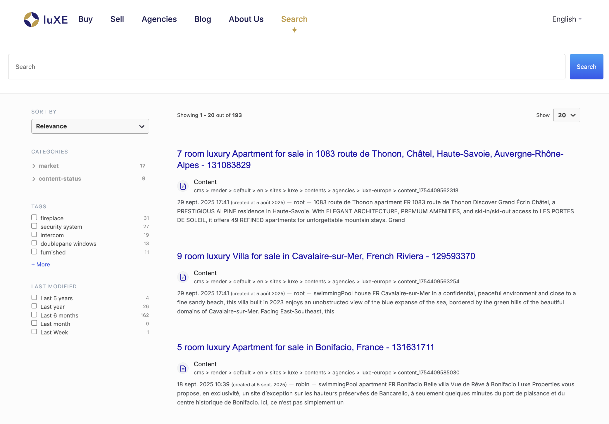

# Augmented-Search tutorial

Building on top of the [previous tutorial](../02-luxe-mariadb), we're going to:

- start an Elasticsearch single-node cluster
- Install augmented-search
- Configure the database connection via a groovy script
- Configure augmented-search to use that connection
- Enable augmented-search on Luxe
- Index Luxe

## Instructions

To get started, execute the following commands:

```bash
cd ~
git clone https://github.com/Jahia/provisioning-tutorials.git
cd ./provisioning-tutorials/03-augmented-search
docker compose up --renew-anon-volumes -d
sleep 10
docker exec --tty elasticsearch /usr/share/elasticsearch/bin/elasticsearch-plugin install --batch analysis-icu
docker exec --tty elasticsearch /usr/share/elasticsearch/bin/elasticsearch-plugin install --batch analysis-stempel
docker exec --tty elasticsearch /usr/share/elasticsearch/bin/elasticsearch-plugin install --batch analysis-kuromoji
docker compose restart elasticsearch
docker logs -f jahia
```

While the elasticsearch cluster is starting, you will first see the MariaDB container booting up and Jahia creating the necessary tables and continue with its startup.

## After startup

At the end of startup (give it a minute or two), open a browser to Luxe's home page at http://localhost:8080 and navigate to the "Search" menu.



You will see the Augmented Search UI on the page (note that this is not an exercise in style, but a demonstration of the provisioning functionality).

### Fiddling with GraphQL API

You can also play with our GraphQL API:

**Query**: As an authenticated user (root), fetch 2 hits across all documents (no search terms) in the **EDIT** workspace

```bash
curl --request POST \
  --url http://localhost:8080/modules/graphql \
  --header 'Content-Type: application/json' \
  --header 'Origin: http://localhost:8080' \
  --header 'authorization: APIToken kgHNm05iQV61I+GY3X5HVr13i866HAAsyou8G+eGubk=' \
  --data '{"query":"query {\n  search(q: \"\", workspace: EDIT) {\n    results(size: 2) {\n      hits {\n        displayableName\n      }\n    }\n  }\n}"}'
```

**Response**:

```bash
{"data":{"search":{"results":{"hits":[{"displayableName":"Singh"},{"displayableName":"Digitall Network Expands To Transportation Industry"}]}}}}
```

You might notice that we searched in the EDIT workspace, which is only accessible to an authenticated user, look at what happens if you run the same query without providing a token:

**Query**: As guest, fetch 2 hits across all documents (no search terms) in the **EDIT** workspace

```bash
curl --request POST \
  --url http://localhost:8080/modules/graphql \
  --header 'Content-Type: application/json' \
  --header 'Origin: http://localhost:8080' \
  --data '{"query":"query {\n  search(q: \"\", workspace: EDIT) {\n    results(size: 2) {\n      hits {\n        displayableName\n      }\n    }\n  }\n}"}'
```

**Response**:

```bash
{"data":{"search":{"results":{"hits":[]}}}}
```

Now try changing the workspace to LIVE, which should work fine as guest.

**Query**: As guest, fetch 2 hits across all documents (no search terms) in the **LIVE** workspace

```bash
curl --request POST \
  --url http://localhost:8080/modules/graphql \
  --header 'Content-Type: application/json' \
  --header 'Origin: http://localhost:8080' \
  --data '{"query":"query {\n  search(q: \"\", workspace: LIVE) {\n    results(size: 2) {\n      hits {\n        displayableName\n      }\n    }\n  }\n}"}'
```

**Response**:

```bash
{"data":{"search":{"results":{"hits":[{"displayableName":"all-Movies"},{"displayableName":"all-Med"}]}}}}
```

**PS**: Since we're not searching on a particular search term, the exact result order between the two workspaces might differ (as they do in the example above).

## What did we learn ?

In this tutorial got much closer to a complex real-world scenario in which we took a released version of Jahia and customized it to our own use case by installing additional modules, and performing some GraphQL queries.

This [provisioning script](./provisioning.yaml) uses a few new commands when compared to the previous tutorial:

- `include` to execute another provisioning script. As you probably noted we were able to run the provisioning script from Tutorial #2 by including it in this script.
- `addMavenRepository` to install modules from another Nexus repository (in this particular case, Jahia Store)
- `enable` to enable a set module with a set siteKey

## Next

In the next tutorial, we're going to add jExperience and forms to the mix [click here](../04-jexperience/).
